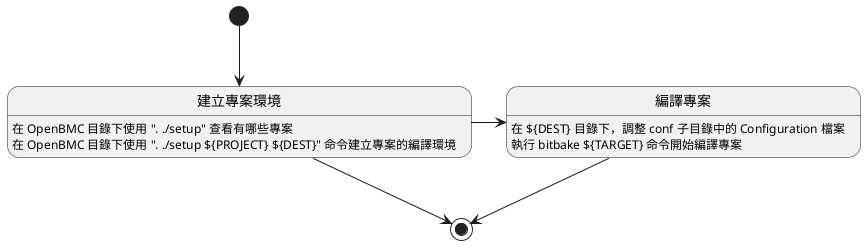
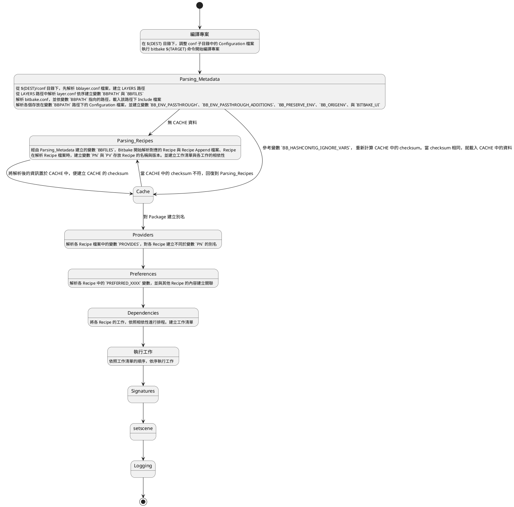

以下是在 OpenBMC 下建立與編譯專案的流程。OpenBMC 是一個整合 Yocto 的特殊專案，提供了單一的方式供使用者建立可以特殊硬體上執行的 BMC 環境。如果要透過 Yocto 建立在特殊硬體上執行的 Linux 環境，流程雖然類似 OpenBMC，但是會比較繁瑣。

# 建立專案環境

OpenEmbedded-Core 可以透過增加 Layer 的方式，增加支援的專案。以下圖為例，OpenEmbbed-Core 目前支援的平台包含了 risc-v。如果你需要建立一個能在 risc-v 平台上跑的 Linux 環境，你可以下載 meta-riscv 到 Yocto 目錄下
![[{0D1A358A-38B8-4FB8-8FF0-9BDA954F5CDA}.png]]

meta-riscv 有很詳細的資料，包含相依性與支援的機器等；在他的 [README.md](https://github.com/riscv/meta-riscv)也提供了詳細建立專案環境的方法，包含了如何下載 meta-riscv 與 Yocto 的方法。透過 README.md 上的建議，我們需要安裝 repo 工具，再透過 repo 去下載完整的 meta-riscv 、OpenEmbedded、與 Yocto。

> sudo apt install repo

![[{11E6A072-8D34-49E1-B46D-B00B5EC5B439}.png]]

透過 repo 命令安裝好 meta-riscv 之後，可以透過命令建立好專案環境

> . ./meta-riscv/setup.sh

這是建立專案之後的輸出。目前可以建立的 Linux 環境有 6 種 targets，差異在於該 firmware 中包含的工具程式的多寡。例如說 core-image-sato 就包含了 GUI 介面，而 core-image-full-cmdline 可能只包含了 terminal。
![[{A6ED0730-BA80-4444-9D5D-86710B2434F9}.png]]

# 編譯專案

## 簡易流程

完整的流程如下圖

我們可以將編譯的流程分成 2 大類：
- 解析檔案
- 執行工作

### 1. Parsing_Metadata

從專案路徑下的 conf/bblayers.conf 中，確認編譯會使用到的路徑清單；再從該路徑清單下的 conf/layer.conf 檔案中，建立兩變數

- `BBPATH` - 用來搜尋 Configuration 檔案 (位於 conf 目錄下) 與 Class 檔案 (位於 classes 目錄下)
- `BBFILES` - 用來搜尋 Recipe 與 Recipe Append 檔案

解析 bitbake.conf，並將該檔案中使用 `include` 或是 `require` 載入的 Include 檔案 (於變數 `BBPATH` 目錄下) 加入 bitbake.conf 檔案。在解析完所有的 Configuration 檔案之後，Bitbake 將建立處理環境變數的變數，包含 `BB_ENV_PASSTHROUGH`、`BB_ENV_PASSTHROUGH_ADDITIONS`、`BB_PRESERVE_ENV`、與 `BB_ORIGENV`。

> [!Note]
> 編譯環境變數將在此步驟改變

### 2. Parsing_Recipes

Bitbake 會先去檢查 Cache 資料是否存在。如果 Cache 資料沒有改變，將略過此步驟，直接載入 Cache 資料。

逐一對變數 `BBFILES` 中儲存的 Recipe 與 Recipe Append 檔案進行解析。針對相關的 Recipe 檔案建立變數 `PN` 與 `PV`，使用變數 `PN` 與 `PV` 為 Key，與 Recipe 相關檔案建立關聯。

> RecipeA_1.0.0.bb  -->  PN = "RecipeA"，PV = "1.0.0"

> [!NOTE]
> Bitbake 會在這階段建立工作清單與相依性清單，但是清單並未與 Recipe 檔案建立關係；類似 C 當中的 Unresolved Symbol。

完成本階段之後，Bitbake 會將建立的資料存放在 Cache 目錄中，且將資料建立 checksum。

### 4. Providers

某些 Recipe 檔案會有多個眾人熟悉的名稱，光是使用 `PN` 實在很難包含這些資訊。以 nginx 為例，使用 "http-server" 或是 "proxy-server" 可能比 "nginx" 更為人所知。

另外，相同功能的 package 可能有多種替代選項。譬如說 "RDBMS" 可能包含 "mysql"、"sqlite" 等眾多選項，因此在 Recipe 檔案中，可能會列出眾多可接受或是偏好的項目。而這些資訊都會成為工作清單與相依性清單中的一部分。

### 5. Preferences

針對工作清單與相依性清單中，未能與 Recipe 檔案建立關係的項目，使用別名或是變數 `PN` 與 `PV` 的組合，建立關聯。

其中有幾個變數用於此階段。前兩者是說明要引用其他 Recipe 的條件，而第 3 個是說明自己這個 Recipe 被選上的順位。

- PREFERRED_PROVIDER_XXXX = ${VALUE}   <--  Package XXXX 偏好使用 ${VALUE}
- PREFERRED_VERSION_XXX = ${VER}           <--  Package XXX 偏好使用 ${VER} 版本
- DEFAULT_PREFERENCE = ${VALUE}              <-- 某個 Recipe 被選上的順序，越高越容易被選上

各 Recipe 檔案預設的 `DEFAULT_PREFERENCE` 跟該 Recipe 的 `PV` 一致，但是可以在 Recipe 檔案中另外指定。通常會在舊版 Recipe 檔案中，會將變數 `DEFAULT_PREFERENCE` 設為 "-1"，表示該 Recipe 檔案不應該被使用。另外，變數 `PREFERRED_VERSION` 的優先權高於 `DEFAULT_PREFERENCE`，所以可以在 Recipe 中指定相依的 Recipe 版本。

### 6. Dependencies

工作的相依性是個很大的議題。除了編譯時的相依性之外，還有執行性的相依性；除此之外，還需要考慮

#### 編譯期間與執行期間的相依性

Bitbake 使用變數 `DEPENDS` 與 `RDEPENDS` 列舉出某一 Recipe 在編譯期與執行期間，所依賴的其他 Packages (Recipe)。

### 7. 執行工作

經過 5 與 6 的步驟，工作清單與相依性清單應該都沒有未與 Recipe 建立關聯的項目，因此在此建立工作排序。Bitbake 會依照變數 `BB_NUMBER_THREADS` 的值，建立多個 Thread 依序執行排序後的工作。執行完的工作，Bitbake 會在 Build 目錄下的 tmp/stamp 自路徑中建立 stamp 檔案
![[{CD61898E-7C34-454F-B711-A579708A04B5}.png]]

在執行某項工作前後，Bitbake 會查詢代表該工作的變數 Flags 來確認執行工作前後，需要額外呼叫的函式。這些變數 Flag 為 `prefuns` 與 `postfuns`，請參考 [[05-Syntax-Functions]] 一章

### 8. Signatures

執行工作後，會依照輸入檔案建立該工作 checksum (Signature)。如果檔案內容不變，則不需要重新執行該工作。

Bitbake 提供一個變數 `BB_BASEHASH_IGNORE_VARS` 供使用者列出不需要作為計算 checksum 的檔案或是路徑清單，譬如說該工具使用的設定檔；如此就可以在不重新編譯該 Recipe 的情況下，修改相關的設定檔

### 9. setscene

### 10. Logging

## 範例

我們繼續以 meta-riscv 為例。下載的路徑在 workspaces/SRC/riscv-yocto 目錄下，透過命令建立好的專案環境則是在 workspaces/SRC/riscv-yocto/build 目錄下；這是因為我們建立專案的時候，使用的命令沒有帶 {DEST} 參數，所以預設就是在當前目錄下的 build 子目錄。

> [!NOTE]
> 完整的命令如下：
>  . ./meta-riscv/setup.sh {PROJECT} {DEST}

> [!IMPORTANT]
> 每次要編譯專案之前，都需要執行一次 `. {SRC}/setup.sh {PROJECT} {DEST}` 命令。
> 
> 除了在沒有專案環境的情況下建立專案環境，另一個原因是設定編譯環境變數。
> 
> 每當使用者關閉 session 之後 (logout 或是關閉 ssh)，下一次要再進行編譯都需要重新執行一次 setup 的命令。不然 session 中缺乏相關的環境變數，編譯會失敗。
### 專案環境

我們先查看一下建立的專案環境，在 build 目錄下有 3 個子目錄：
- cache     <-- 存放 Cache 的路徑
- conf       <-- Configuration 檔案
- tmp        <-- 預設編譯時的原始檔、物件檔、與最後產生的 image 檔所使用的路徑
![[{60C81F19-D29A-4AC8-ABA5-A0D7BBF8A110}.png]]

#### conf 目錄

這邊存放專案用到的 Configuration 檔案，在步驟 Parsing_Metadata 中使用。其中比較重要的包含：

##### bblayers.conf 檔案

這個檔案是 OpenEmbedded-Core 的核心 Configuration 檔案之一。

透過指定變數 BBLAYERS，bitbake 將會知道該從哪些路徑讀取 [[docs/computer/framework/OpenBMC/OpenEmbedded/bitbake/Readme|Metadata]] 。
![[{95D4F4A7-6A6A-443B-9A53-4D03CAC1DF2A}.png]]

##### local.conf 檔案

這個是專案核心設定檔，內容包含了 Firmware Image 所使用的平台、編譯專案使用的目錄、Firmware 上工具的集合等設定。使用者將透過修改這個檔案，對專案進行客製化的動作。使用的變數包含：

| 變數名稱                     | 說明                                        | 檔案位置                       |
| :----------------------- | :---------------------------------------- | -------------------------- |
| MACHINE                  | 執行 firmware 的平台  可能是虛擬機 (qemu) 或是實際的硬體 | poky/meta/conf/machine     |
| DISTRO                   | Firmware 預設的功能集合，目前 Yocto 專案使用 poky       | poky/meta-poky/conf/distro |
| DL_DIR                   | 編譯時，下載原始碼的目錄                              |                            |
| SSTATE_DIR               | 編譯時，用來記錄專案編譯狀態的目錄                         |                            |
| TMPDIR                   | 編譯時，用來處理編譯流程的目錄                           |                            |
| BB_DISKMON_DIRS          | 編譯時，透過監控硬碟空間決定是否要終止編譯                     |                            |
| EXTRA_IMAGE_FEATURES  | Firmware 應包含哪些功能，可接受的值來自 Class 檔案         | poky/meta/*                |
| BB_NUMBER_THREADS        | 編譯時，可以使用的 CPU Thread 數量                   |                            |

### 編譯

當修改完 Configuration 檔案之後，最後要進行的動作就是編譯並建立 firmware image。當我們執行完 `setup.sh` 命令之後，會出現類似的提示字串說明該如何建立 firmware image。
![[{A6ED0730-BA80-4444-9D5D-86710B2434F9}.png]]

我們還是以 risc-v 為例，建立一個有 GUI 環境的 Linux Firmware Image。我們只需要執行命令

> bitbake core-image-sato

反之，如果我們只需要 Terminal 環境，那就執行命令

> bitbake core-image-full-cmdline

不管是建立甚麼樣的 firmware image，都會出現類似的資訊，將編譯時的狀況反饋給使用者
![[{F10C8893-C240-49C4-BF3B-7B4C7173E473}.png]]
